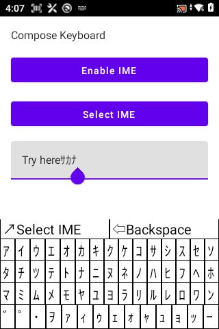

A straightforward Android IME for inputing half katakana of Japanese language.

率直な日本語の半角カタカナを入力するためのAndroid IME。
=====================

Donation: POL: 0x4444982544690009a6d3f2c3cb24e3c9b54c1111
Thank you.

